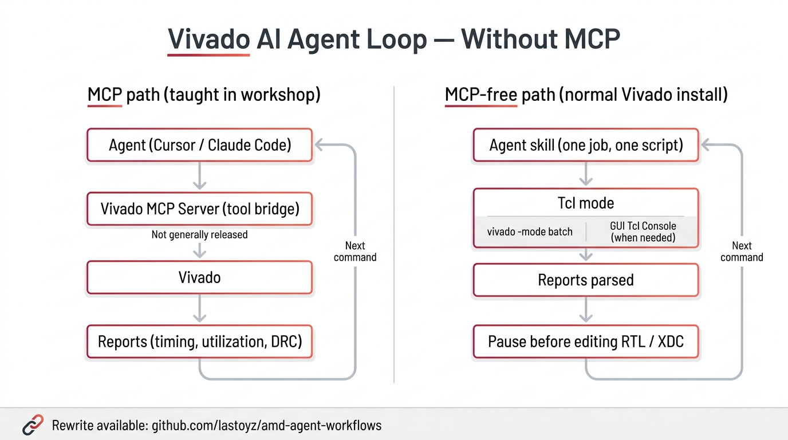

# AMD FPGA Agent Workflows

Execution skills that Cursor / Claude Code follow when running AMD FPGA flows **without a Vivado MCP Server**.

One job = one script. Do not call MCP tools (`vivado_start`, `vivadoExecute`, `mcp_vivado-*`).

| Area | How to run | What official AMD Git has | This repo |
| --- | --- | --- | --- |
| **Vivado** | `vivado -mode batch` / `-mode gui` / terminal grep | ECS Lab skills assume MCP. No Tcl bypass on public Git | MCP → Tcl replacements (8) + mode guide |
| **Vitis** | `vitis -s script.py`, `v++` / `vitis-run` | [Xilinx/ai-assisted-vitis](https://github.com/Xilinx/ai-assisted-vitis) (`vhls-opt`, `xsct-to-python-converter`) | CLI/Python batch recipes (no MCP) |
| **host_sw** | XDMA character devices, XRT | None (driver repos only) | bringup / XDMA / XRT |

Do not put example RTL or lab zips here. MCP lab originals live in [lastoyz/amd_vm](https://github.com/lastoyz/amd_vm) under **`lab_training/`**. The Tcl/agentic path without MCP is **`without-mcp/`** (started as lab-skill replacements, then extended with official workflows).

Official AMD Git clones and links are collected in **[official/](official/README.md)**. Submodules point at the upstream repos as-is.

## The loop (without MCP)

The ECS APAC Seoul workshop labs connect Cursor / Claude Code to Vivado through a **Vivado MCP Server**. That server is **not generally released**. This repository is the right-hand path: a normal Vivado install, Tcl mode, reports on disk.



| | MCP path (workshop) | MCP-free path (this repo) |
| --- | --- | --- |
| Bridge | Vivado MCP Server (tool calls) | Agent skill — one job, one `.tcl` / `.py` |
| How Vivado runs | MCP `vivado_start` / `vivadoExecute` | `vivado -mode batch`, or the GUI Tcl Console when you need waveforms or Hardware Manager |
| Reports | Returned through MCP | Parsed from files (`grep` / a small script) |
| Guardrail | Lab HITL | **Pause before editing RTL / XDC**, then the next command |

Left column is what the workshop taught. Right column is what you can run today without waiting for MCP.

## How to give this to an agent

Opening this repo as the workspace auto-loads `.cursor/skills/` and `.claude/skills/`.

To use from another FPGA project:

```powershell
# Windows — install as user skills
.\install.ps1
```

```bash
# Linux / Git Bash
./install.sh
```

Example prompt:

```text
Do not use Vivado MCP.
Read the skills index and follow the matching SKILL.md in order.
One job = one .tcl or one .py. On failure, do not retry with a different syntax — show the error and stop.
```

## Skill index

### Vivado

| Skill | When | Mode |
| --- | --- | --- |
| [vivado-modes](skills/vivado-modes/SKILL.md) | Choosing batch / GUI / tcl | — |
| [vivado-rtl-lint](skills/vivado-rtl-lint/SKILL.md) | RTL lint before synthesis | batch |
| [vivado-opt-design](skills/vivado-opt-design/SKILL.md) | What opt actually did | terminal only |
| [vivado-multi-run](skills/vivado-multi-run/SKILL.md) | Compare several impl strategies | terminal only |
| [vivado-axi4-debug](skills/vivado-axi4-debug/SKILL.md) | AXI protocol sim + waveforms | GUI required |
| [vivado-post-route](skills/vivado-post-route/SKILL.md) | Classify and highlight failing paths | batch → GUI |
| [vivado-timing-closure](skills/vivado-timing-closure/SKILL.md) | XDC + re-impl (max 3) | approval → batch |
| [vivado-bd-ila](skills/vivado-bd-ila/SKILL.md) | Insert ILA into a BD | GUI or batch |
| [vivado-bd-vio](skills/vivado-bd-vio/SKILL.md) | VIO in a BD + HW Manager | GUI |

### Vitis

| Skill | When | Mode |
| --- | --- | --- |
| [vitis-unified](skills/vitis-unified/SKILL.md) | XSA → platform → app → ELF | `vitis -s` |
| [vitis-hls](skills/vitis-hls/SKILL.md) | csim / csynth / cosim / pack | `v++` / `vitis-run` |
| [vitis-xsct](skills/vitis-xsct/SKILL.md) | Leftover XSCT Tcl only | `xsct` → migrate to Python |

### Host software

| Skill | When |
| --- | --- |
| [host-bringup](skills/host-bringup/SKILL.md) | Align bit/xsa/ELF and the host app in one sequence |
| [host-xdma](skills/host-xdma/SKILL.md) | PCIe XDMA user app (`/dev/xdma*`) |
| [host-xrt](skills/host-xrt/SKILL.md) | Alveo / Versal XRT (`xclbin`, `xbutil`) |

## Repository layout

```
amd-agent-workflows/
├── README.md                 ← this file
├── AGENTS.md                 ← agent contract (no MCP)
├── skills/                   ← our MCP-less skills (source)
├── .cursor/skills/           ← copy for Cursor auto-load
├── .claude/skills/           ← copy for Claude Code auto-load
├── official/                 ← official AMD Git (submodules + snapshot)
│   ├── README.md             ← upstream URLs · why cloned · link-only entries
│   ├── amd-skills/           ← submodule  github.com/amd/skills
│   ├── ai-assisted-vitis/    ← submodule  github.com/Xilinx/ai-assisted-vitis
│   ├── fpl26-optimization-contest/  ← submodule  github.com/Xilinx/fpl26_optimization_contest
│   ├── magpie/               ← submodule  github.com/AMD-AGI/Magpie
│   └── mlir-aie-skills/      ← Xilinx/mlir-aie `skills/` snapshot (full repo ~2 GB)
├── install.ps1 / install.sh
└── .gitmodules
```

Clone with `--recurse-submodules` to also fetch the official repos.

## Upstream (official Git)

Full table and links: **[official/README.md](official/README.md)**. Summary:

| Upstream | Location in this repo | Notes |
| --- | --- | --- |
| https://github.com/amd/skills | `official/amd-skills/` (submodule) | Company-wide skill catalog. No FPGA |
| https://github.com/Xilinx/ai-assisted-vitis | `official/ai-assisted-vitis/` (submodule) | `vhls-opt`, `xsct-to-python-converter` |
| https://github.com/Xilinx/fpl26_optimization_contest | `official/fpl26-optimization-contest/` (submodule) | The side that **uses** VivadoMCP |
| https://github.com/AMD-AGI/Magpie | `official/magpie/` (submodule) | Official pattern for replacing MCP with CLI skills |
| https://github.com/Xilinx/mlir-aie | `official/mlir-aie-skills/` (skills/ only) | AIE/NPU skills. Full repo is link-only |
| https://github.com/amd/gaia , [Quark](https://github.com/amd/Quark) | link only | Agent runtime / quantization |
| https://github.com/AMD-AGI/TraceLens , [Hyperloom](https://github.com/AMD-AGI/Hyperloom), [maxtext-slurm](https://github.com/AMD-AGI/maxtext-slurm) | link only | GPU. Large |

ECS Lab Vivado Agent Skills (`rtl-lint` and similar) have no MCP-less Tcl guide on public official Git. That bypass lives here as `skills/vivado-*`.

## Mirrors

| Host | URL |
| --- | --- |
| GitHub (English, `main`) | https://github.com/lastoyz/amd-agent-workflows |
| GitHub (Korean, `ko`) | https://github.com/lastoyz/amd-agent-workflows/tree/ko |

## Related

- Lab mirror: [lastoyz/amd_vm](https://github.com/lastoyz/amd_vm) · MCP originals in `lab_training/` · Tcl/agentic in `without-mcp/`
- Confluence: [Vivado Agent Skill — Tcl batch/GUI bypass without MCP](https://edelway.atlassian.net/wiki/spaces/~712020a9f82d3b6447487d89a832eff8293188/pages/56786949)
